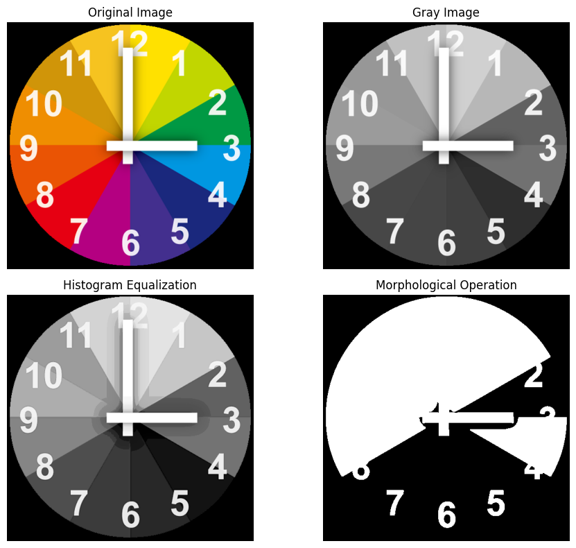

# **Experiment 2: Image Enhancement and Morphological Operations**

### **Aim**

To perform various image enhancement and processing operations on an input image. This includes grayscale conversion, contrast enhancement using histogram equalization, binarization, and noise removal using morphological operations.

### **Algorithm**

1.  **Start**
2.  Import necessary libraries: `OpenCV (cv2)` for image processing, `NumPy` for numerical tasks, and `Matplotlib` for plotting.
3.  Load the input image using `cv2.imread()`.
4.  Convert the color image to grayscale using `cv2.cvtColor()`.
5.  Perform histogram equalization on the grayscale image using `cv2.equalizeHist()` to enhance contrast.
6.  Binarize the grayscale image using the `cv2.threshold()` function with Otsu's method to automatically find the optimal threshold.
7.  Define a 3x3 kernel (structuring element) for morphological operations.
8.  Perform a morphological 'Opening' operation on the binary image using `cv2.morphologyEx()` to remove small noise artifacts.
9.  Save the generated grayscale, histogram equalized, and morphologically opened images to the disk.
10. Create a `matplotlib` figure to display multiple images.
11. Plot the original image, grayscale image, histogram equalized image, and the result of the morphological operation in a 2x2 grid.
12. Display the final plot.
13. **Stop**

### **Inputs and Outputs**

  * **Input:** An image file (e.g., `clock.png`).
  * **Outputs:**
    1.  Three saved image files: `GrayImg.jpg`, `HistogramEqualization.jpg`, and `MorphologicalOperation.jpg`.
    2.  A plot window displaying the four stages of image processing: Original, Grayscale, Histogram Equalized, and Morphological Operation.

### **Theory**

#### 1\. Grayscale Conversion

A grayscale image is one in which the value of each pixel is a single sample representing only an amount of light, or intensity. It contains no color information. Converting a color image (like RGB) to grayscale simplifies the image data from three channels to one, which is essential for many image processing tasks. The conversion is typically done by taking a weighted average of the Red, Green, and Blue channels.

#### 2\. Histogram Equalization

An image histogram is a graphical representation of the distribution of pixel intensity values. **Histogram Equalization** is a contrast enhancement technique that works by redistributing the pixel intensities to create a more uniform (flatter) histogram. It spreads out the most frequent intensity values, resulting in a higher overall contrast. This is particularly useful for images that appear washed out or have very dark/bright regions where details are obscured.

#### 3\. Image Binarization (Thresholding)

Binarization is the process of converting a grayscale image into a binary image, which contains only two pixel values: black (0) and white (255). This is achieved through **thresholding**. A threshold value is selected, and all pixel intensities below this value are set to 0, while those above are set to 255.

  * **Otsu's Method**: Instead of manually choosing a threshold, Otsu's method (`cv2.THRESH_OTSU`) automatically determines an optimal threshold value from the image histogram. It assumes the histogram contains two peaks (bimodal) and finds the threshold that minimizes the intra-class variance between the black and white pixels.

#### 4\. Morphological Operations

Morphological operations are a set of non-linear techniques that process images based on shapes. They apply a **structuring element** or **kernel** to an input image to probe and modify its structure.

  * **Kernel**: A small matrix (e.g., a 3x3 square) that scans over the image.
  * **Opening**: The 'Opening' operation is defined as an **erosion** followed by a **dilation**.
      * **Erosion**: Removes pixels at the boundaries of objects. It is used to eliminate small white noise and thin out connections between objects.
      * **Dilation**: Adds pixels to the boundaries of objects. It is used to fill small holes and gaps.
      * The combination, **Opening**, is effective at removing small noise "islands" (salt noise) from an image without significantly altering the size and shape of the larger objects.

-----

### **Code**

```python
# Import necessary libraries
import cv2                      # OpenCV for image processing
import numpy as np              # NumPy for numerical operations
import matplotlib.pyplot as plt # Matplotlib for visualization

# --- INPUT ---
# Read the input image (replace with your file path)
# The user's input file was clock.png
img = cv2.imread("path/to/your/clock.png")

# Convert the image from BGR (OpenCV default) to Grayscale
gray = cv2.cvtColor(img, cv2.COLOR_BGR2GRAY)

# Apply Histogram Equalization to enhance contrast
HistEq = cv2.equalizeHist(gray)

# Apply Otsu's Thresholding to binarize the grayscale image
# It returns the threshold value and the thresholded image. We need the image [1].
binr = cv2.threshold(gray, 0, 255, cv2.THRESH_BINARY + cv2.THRESH_OTSU)[1]

# Define a kernel for morphological operations (3x3 matrix of ones)
kernel = np.ones((3, 3), np.uint8)

# Apply Morphological Opening to remove small noise (Erosion followed by Dilation)
opening = cv2.morphologyEx(binr, cv2.MORPH_OPEN, kernel, iterations=1)

# --- OUTPUTS (Saved Files) ---
# Save intermediate images to disk (replace with your desired output path)
cv2.imwrite("path/to/your/outputs/GrayImg.jpg", gray)
cv2.imwrite("path/to/your/outputs/HistogramEqualization.jpg", HistEq)
cv2.imwrite("path/to/your/outputs/MorphologicalOperation.jpg", opening)


# --- OUTPUT (Plot) ---
# Plotting all stages of processing using matplotlib
plt.figure(figsize=(10, 8))

# Display Original Image
plt.subplot(2, 2, 1)
# Convert BGR to RGB for correct color display in Matplotlib
plt.imshow(cv2.cvtColor(img, cv2.COLOR_BGR2RGB))
plt.title("Original Image")
plt.axis('off')

# Display Grayscale Image
plt.subplot(2, 2, 2)
plt.imshow(gray, cmap='gray')
plt.title("Gray Image")
plt.axis('off')

# Display Histogram Equalized Image
plt.subplot(2, 2, 3)
plt.imshow(HistEq, cmap='gray')
plt.title("Histogram Equalization")
plt.axis('off')

# Display Morphological Operation Result
plt.subplot(2, 2, 4)
plt.imshow(opening, cmap='gray')
plt.title("Morphological Operation")
plt.axis('off')

# Adjust layout and show all plots
plt.tight_layout()
plt.show()
```

-----

### **Code Output**

*This plot shows the result of running the program on the input image.*



-----

### **Code Explanation**

1.  **Import Libraries**: Import `cv2` for image functions, `numpy` to create the kernel, and `matplotlib` to display the results in a single window.
2.  **Load Image**: `cv2.imread()` loads the specified image. It's important to note that OpenCV loads images in BGR color channel order by default.
3.  **Grayscale Conversion**: `cv2.cvtColor(img, cv2.COLOR_BGR2GRAY)` converts the 3-channel BGR image into a single-channel grayscale image.
4.  **Histogram Equalization**: `cv2.equalizeHist()` takes the grayscale image and applies the equalization algorithm to improve its contrast.
5.  **Binarization**: `cv2.threshold()` is used to create a binary image. We use `cv2.THRESH_OTSU` to let the algorithm find the best threshold automatically. The function returns a tuple `(threshold_value, image)`, so we select the image with `[1]`.
6.  **Kernel Creation**: `np.ones((3, 3), np.uint8)` creates a 3x3 square matrix of ones, which will serve as the structuring element for our morphological operation.
7.  **Morphological Opening**: `cv2.morphologyEx()` is a general function for morphological operations. We pass the binary image, specify the operation as `cv2.MORPH_OPEN`, and provide the kernel.
8.  **Plotting**:
      * `plt.figure()` creates the main window for the plots.
      * `plt.subplot(2, 2, n)` creates a 2x2 grid and selects the n-th position to draw the next image.
      * `plt.imshow()` displays an image. For the original color image, we convert it from BGR to RGB so `matplotlib` shows the colors correctly. For grayscale images, we specify `cmap='gray'`.
      * `plt.axis('off')` removes the x and y axes for a cleaner look.
      * `plt.show()` displays the final figure.

-----

### **Result**

The program successfully executed a pipeline of image processing techniques. The input image was converted to grayscale, its contrast was enhanced via histogram equalization, and it was binarized and cleaned using a morphological opening operation. The results of each key step were saved as separate image files and displayed together in a final plot.

### **Inference**

This experiment effectively demonstrates a standard workflow in image pre-processing.

  * **Histogram Equalization** visibly enhanced the contrast of the clock face, making the numbers and hands much clearer than in the original grayscale image.
  * **Morphological Opening** successfully removed small, isolated pixels (noise) from the binarized image, resulting in a cleaner representation of the main object (the clock).
    Each step serves a distinct purpose in refining an image for analysis or feature extraction.