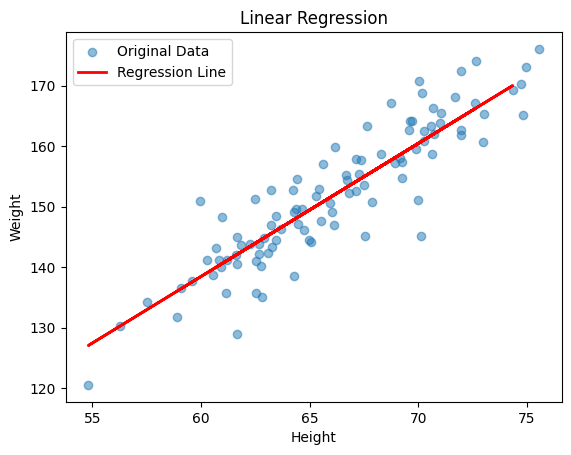

Of course\! Here is the detailed markdown file for your first experiment on Linear Regression.

---

# **Experiment 1: Linear Regression**

### **Aim**

To implement a simple linear regression model from scratch using Python's `scikit-learn` library. The goal is to predict a person's **Weight** based on their **Height**.

### **Algorithm**

1.  **Start**
2.  Import necessary libraries (`pandas`, `numpy`, `matplotlib`, `sklearn`).
3.  Load the dataset from the `data.csv` file into a pandas DataFrame.
4.  Separate the feature (independent variable 'Height') and the target (dependent variable 'Weight').
5.  Split the dataset into a training set (70%) and a testing set (30%) to evaluate the model's performance on unseen data.
6.  Reshape the feature and target arrays to be compatible with the `scikit-learn` library requirements.
7.  Create an instance of the `LinearRegression` model.
8.  Train the model using the training data with the `.fit()` method.
9.  Make predictions on the test data using the trained model's `.predict()` method.
10. Calculate the Mean Squared Error (MSE) to evaluate the model's accuracy.
11. Visualize the results by plotting the original data points and the learned regression line.
12. **Stop**

### **Inputs and Outputs**

- **Input:** A CSV file named `data.csv` containing two columns: 'Height' and 'Weight'.
- **Outputs:**
  1.  The **Mean Squared Error (MSE)** printed to the console.
  2.  A **scatter plot** showing the original data points along with the linear regression line that best fits the data.

### **Theory**

#### 1\. Regression

Regression is a statistical method used in finance, investing, and other disciplines that attempts to determine the strength and character of the relationship between one dependent variable (usually denoted by Y) and a series of other variables (known as independent variables).

#### 2\. Linear Regression

Linear Regression is the most basic type of regression. It is a supervised machine learning algorithm that models a linear relationship between a single independent variable ($X$) and a dependent variable ($Y$). The goal is to find the best-fitting straight line through the data points. This line is called the "regression line".

The equation for a simple linear regression line is:
$$Y = \beta_0 + \beta_1X + \epsilon$$
Where:

- $Y$ is the predicted value of the dependent variable (Weight).
- $X$ is the independent variable (Height).
- $\\beta\_1$ is the **slope** of the line, representing the change in $Y$ for a one-unit change in $X$.
- $\\beta\_0$ is the **intercept**, the value of $Y$ when $X$ is 0.
- $\\epsilon$ (epsilon) is the **error term**, representing the difference between the actual value and the predicted value. The model aims to minimize this error.

#### 3\. Cost Function: Mean Squared Error (MSE)

To find the "best-fitting line," the model needs a way to measure how well a given line fits the data. This is done using a **cost function**. The cost function quantifies the error between the predicted values and the actual values. For linear regression, the most common cost function is the **Mean Squared Error (MSE)**.

MSE is calculated by taking the average of the squared differences between the actual values ($y\_i$) and the predicted values ($\\hat{y}\_i$).
The formula for MSE is:
$$MSE = \frac{1}{n} \sum_{i=1}^{n} (y_i - \hat{y}_i)^2$$
Where:

- $n$ is the number of data points.
- $y\_i$ is the actual value for the i-th data point.
- $\\hat{y}\_i$ is the value predicted by the model for the i-th data point.

The goal of training the linear regression model is to find the values of $\\beta\_0$ and $\\beta\_1$ that minimize this MSE value.

#### 4\. Train-Test Split

To evaluate a model's performance, we split our dataset into two parts:

- **Training Set:** The subset of the data used to train the model. The model learns the relationship between the features and the target from this data.
- **Testing Set:** The subset of the data that the model has never seen before. We use this set to evaluate how well the model generalizes to new, unseen data. This helps us understand if the model is overfitting (performing well on training data but poorly on new data).

---

### **Code**

```python
import pandas as pd
import numpy as np
import matplotlib.pyplot as plt
from sklearn.model_selection import train_test_split
from sklearn.linear_model import LinearRegression
from sklearn.metrics import mean_squared_error

# Load the dataset
df = pd.read_csv("../files/data.csv")

# Define features (X) and target (y)
X = df.loc[:, 'Height'].values
y = df.loc[:, 'Weight'].values

# Split data into training and testing sets
X_train, X_test, y_train, y_test = train_test_split(X, y, test_size=0.3, random_state=123)

# Reshape arrays for scikit-learn
X_train = X_train.reshape(-1, 1)
y_train = y_train.reshape(-1, 1)
X_test = X_test.reshape(-1, 1)
y_test = y_test.reshape(-1, 1)

# Create and train the Linear Regression model
model = LinearRegression().fit(X_train, y_train)

# Make predictions on the test set
y_pred = model.predict(X_test)

# Calculate Mean Squared Error
mse = mean_squared_error(y_true=y_test, y_pred=y_pred)
print("Mean Squared Error : ", round(mse, 3))

# Plot original data and the regression line
plt.scatter(X, y, label="Original Data", alpha=0.5)
plt.plot(X_test, y_pred, color='red', linewidth=2, label="Regression Line")
plt.title("Linear Regression")
plt.xlabel("Height")
plt.ylabel("Weight")
plt.legend()
plt.show()
```

---

### **Code Output**

**Text Output**

```
Mean Squared Error :  30.863
```

**Plot**

## 

### **Code Explanation**

1.  **Import Libraries**: We import `pandas` for data manipulation, `numpy` for numerical operations, `matplotlib.pyplot` for plotting, and specific modules from `sklearn` for model creation, data splitting, and evaluation.
2.  **Load Data**: `pd.read_csv("data.csv")` reads the dataset into a pandas DataFrame.
3.  **Feature and Target**: We select the 'Height' column as our feature `X` and the 'Weight' column as our target `y`. `.values` converts them into NumPy arrays.
4.  **Split Data**: `train_test_split` divides the data. `test_size=0.3` allocates 30% of the data for the test set and 70% for training. `random_state=123` ensures that the split is the same every time the code is run, making the results reproducible.
5.  **Reshape Data**: `scikit-learn`'s `LinearRegression` model expects the feature `X` to be a 2D array. We use `.reshape(-1, 1)` to convert our 1D height and weight arrays into 2D column vectors.
6.  **Train Model**: `LinearRegression()` creates an instance of the model. The `.fit(X_train, y_train)` method then trains the model by finding the optimal intercept ($\\beta\_0$) and slope ($\\beta\_1$) that minimize the MSE for the training data.
7.  **Predict**: `model.predict(X_test)` uses the trained model to predict the weights for the heights in the test set.
8.  **Evaluate**: `mean_squared_error` computes the MSE between the actual weights (`y_test`) and the predicted weights (`y_pred`), giving us a measure of the model's prediction error.
9.  **Plot Results**: `plt.scatter` creates a scatter plot of all original data points. `plt.plot` draws the regression line (in red) using the test heights (`X_test`) and their corresponding predicted weights (`y_pred`).

---

### **Result**

The linear regression model was successfully implemented, trained, and tested. The model achieved a **Mean Squared Error (MSE) of 30.863** on the test data. The generated plot visually confirms that the regression line provides a reasonable linear fit to the height and weight data.

### **Inference**

The experiment demonstrates the effectiveness of linear regression for modeling relationships between two continuous variables. The relatively low MSE indicates that the model can predict a person's weight from their height with a reasonable degree of accuracy for this dataset. The visual plot shows a clear positive linear relationship: as height increases, weight also tends to increase, and the model has successfully captured this trend.
